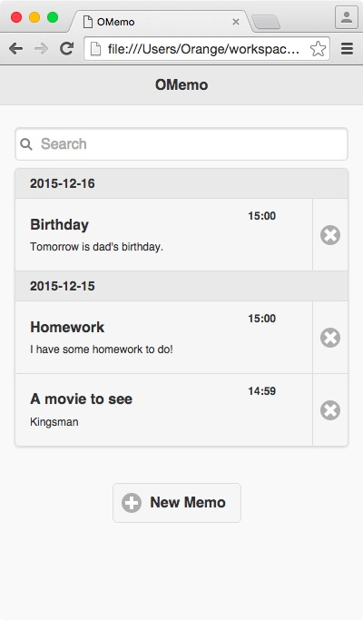
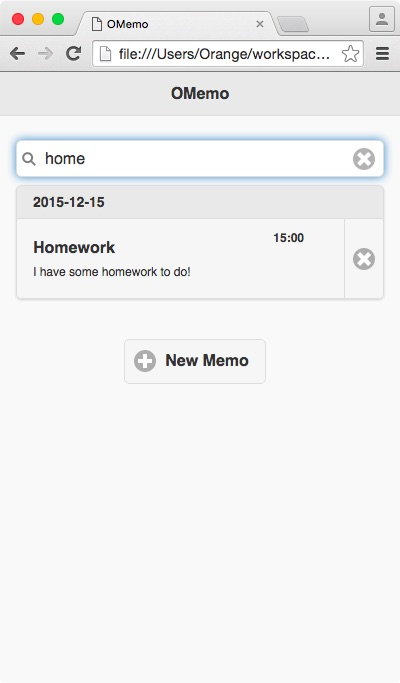
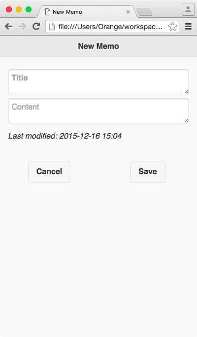
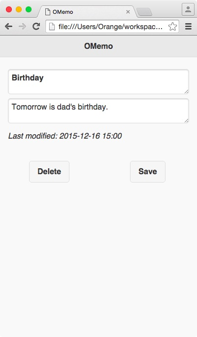

##OMemo -- A simple notekeeper

##Overview

Just as the name suggests, OMemo is a light and simple memorandum application based on HTML5.   
It contains a small set of common used function which can help you memorize your future plans, daily trifles, and even your homework to do.

##Usage

You can have a quick start with OMemo by:

* New a memo  
* Delete an existed memo  
* Search a memo with key words  
* Check and Modify the old memo  

##Features

* Light weight
* Fresh and comfortable UI
* Memo listed in order of time modified
* Search items with Ajex technology

##Technology dependence

* jQuery for JavaScript operation
* jQuery mobile for mobile UI

##Screen shots

